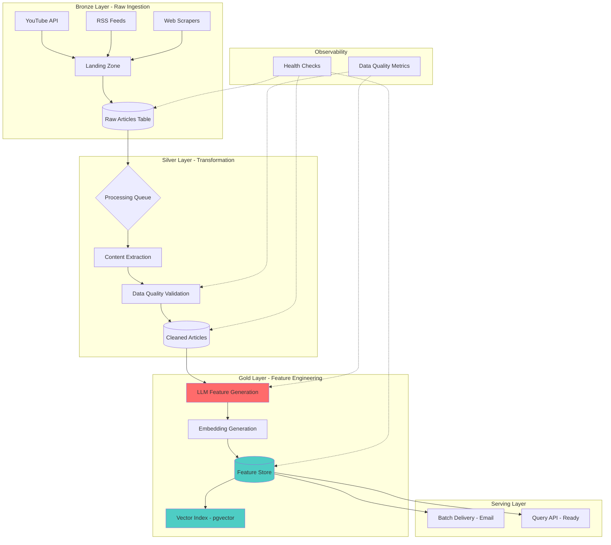

# NexusFeed: A Scalable Feature Engineering Pipeline for Unstructured Data
*Production data pipeline implementing medallion architecture with LLM-powered feature generation and vector search capabilities.*

[](https://python.org)
[](https://postgresql.org)
[](https://docker.com)
[](https://github.com/JoelJohnsonThomas/nexus-pipeline/actions/workflows/tests.yml)
[](LICENSE)

## 🎯 **The Data Engineering Pitch**

This is not an application. This is a **production data pipeline** that operationalizes the complete lifecycle of unstructured content:

1. **Ingests** raw data from heterogeneous sources (YouTube, Blogs, RSS) into a unified landing zone
2. **Transforms** unstructured text into structured AI features (summaries, embeddings) through LLM-powered feature engineering  
3. **Loads** processed features into a query-optimized feature store with vector search capabilities
4. **Serves** enriched data to downstream applications via scheduled batch delivery and API-ready schemas
5. **Ensures** data quality, lineage tracking, and pipeline reliability with full observability

---

## 🏗️ **Data Pipeline Architecture**


```mermaid
graph TB
    subgraph "Bronze Layer - Raw Ingestion"
        A[YouTube API] --> E[Landing Zone]
        B[RSS Feeds] --> E
        C[Web Scrapers] --> E
        E --> D[(Raw Articles Table)]
    end
    
    subgraph "Silver Layer - Transformation"
        D --> F{Processing Queue}
        F --> G[Content Extraction]
        G --> H[Data Quality Validation]
        H --> I[(Cleaned Articles)]
    end
    
    subgraph "Gold Layer - Feature Engineering"
        I --> J[LLM Feature Generation]
        J --> K[Embedding Generation]
        K --> L[(Feature Store)]
        L --> M[Vector Index - pgvector]
    end
    
    subgraph "Serving Layer"
        L --> N[Batch Delivery - Email]
        L --> O[Query API - Ready]
    end
    
    subgraph "Observability"
        P[Health Checks] -.-> D
        P -.-> I
        P -.-> L
        Q[Data Quality Metrics] -.-> H
        Q -.-> J
    end
    
    style J fill:#ff6b6b
    style L fill:#4ecdc4
    style M fill:#4ecdc4
```

---

## 🚨 **Data Engineering Patterns Implemented**

| Common Pattern | How This Pipeline Implements It |
|----------------|----------------------------------|
| **Medallion Architecture** | Clear separation: Raw (Bronze) → Cleaned (Silver) → Enriched (Gold) |
| **Feature Store** | PostgreSQL + pgvector as versioned feature storage with efficient retrieval |
| **Idempotent Processing** | Pipeline runs produce identical output given same input, enabled by `scraped_at` tracking |
| **Incremental Loading** | Only processes new/changed content since last successful run |
| **Data Quality Gates** | Validation at extraction, summarization, and embedding stages with automatic retries |
| **Observability** | End-to-end pipeline monitoring with structured logging and health checks |

---

## 🔥 **Key Engineering Decisions (Data/AI Engineer Interview Focus)**

### 1. Schema Design for Feature Evolution

```sql
-- Designed for backward compatibility and feature versioning
CREATE TABLE articles (
    id SERIAL PRIMARY KEY,
    source_id INTEGER REFERENCES sources(id),
    url VARCHAR(2048) UNIQUE,
    title TEXT,
    content TEXT,  -- Raw content preserved for reprocessing
    published_at TIMESTAMP WITH TIME ZONE,
    scraped_at TIMESTAMP WITH TIME ZONE DEFAULT NOW()
);

CREATE TABLE article_summaries (
    id SERIAL PRIMARY KEY,
    article_id INTEGER REFERENCES articles(id),
    summary TEXT NOT NULL,
    key_points TEXT[],  -- Array type for structured features
    llm_model_used VARCHAR(100) DEFAULT 'gemini-2.5-flash',
    created_at TIMESTAMP WITH TIME ZONE DEFAULT NOW()
);

CREATE TABLE article_embeddings (
    id SERIAL PRIMARY KEY,
    article_id INTEGER REFERENCES articles(id),
    embedding vector(384),  -- pgvector for semantic search
    model_version VARCHAR(100) DEFAULT 'all-MiniLM-L6-v2',
    created_at TIMESTAMP WITH TIME ZONE DEFAULT NOW()
);

-- Support for pipeline state tracking
CREATE TABLE processing_queue (
    id SERIAL PRIMARY KEY,
    article_id INTEGER REFERENCES articles(id),
    status VARCHAR(50),  -- pending, extracting, summarizing, embedding, complete, failed
    retry_count INTEGER DEFAULT 0,
    error_message TEXT,
    updated_at TIMESTAMP WITH TIME ZONE DEFAULT NOW()
);

-- Performance indexes (from scripts/optimize_database.py)
CREATE INDEX idx_articles_published_at ON articles(published_at DESC);
CREATE INDEX idx_summaries_article_id ON article_summaries(article_id);
CREATE INDEX idx_embeddings_article_id ON article_embeddings(article_id);
CREATE INDEX idx_queue_status ON processing_queue(status);
```

### 2. Idempotent ETL Pipeline with State Management

```python
# app/orchestrator/pipeline.py
class ArticlePipeline:
    """
    Idempotent data pipeline implementing exactly-once processing semantics.
    Uses RQ (Redis Queue) for distributed task execution.
    """
    
    def process_article(self, article_id: int):
        """
        Orchestrates multi-stage feature generation pipeline.
        Each stage is idempotent and resumable from failure.
        """
        # Stage 1: Content Extraction (Bronze → Silver)
        extraction_job = self.extraction_queue.enqueue(
            extract_article_content,
            article_id,
            retry=Retry(max=3, interval=[10, 30, 60])
        )
        
        # Stage 2: LLM Feature Engineering (Silver → Gold)
        summarization_job = self.summarization_queue.enqueue(
            generate_summary_features,
            article_id,
            depends_on=extraction_job,
            retry=Retry(max=3, interval=[10, 30, 60])
        )
        
        # Stage 3: Embedding Generation (Gold → Feature Store)
        self.embedding_queue.enqueue(
            generate_embedding_features,
            article_id,
            depends_on=summarization_job,
            retry=Retry(max=2, interval=[10, 30])
        )
    
    def get_pipeline_status(self) -> dict:
        """Returns current pipeline health and queue depths"""
        return {
            'queues': {
                'extraction': {
                    'count': len(self.extraction_queue),
                    'failed': self.extraction_queue.failed_job_registry.count
                },
                'summarization': {
                    'count': len(self.summarization_queue),
                    'failed': self.summarization_queue.failed_job_registry.count
                },
                'embedding': {
                    'count': len(self.embedding_queue),
                    'failed': self.embedding_queue.failed_job_registry.count
                }
            }
        }
```

### 3. LLM-Powered Feature Engineering at Scale

```python
# app/processing/llm_summarizer.py
from tenacity import retry, stop_after_attempt, wait_exponential

class LLMFeatureEngineer:
    """
    Transforms raw article content into structured AI features.
    Implements caching, retries, and cost optimization.
    """
    
    @retry(
        stop=stop_after_attempt(3),
        wait=wait_exponential(multiplier=1, min=4, max=10)
    )
    def generate_summary_features(self, article: Article) -> dict:
        """
        Generates structured summary features from unstructured text.
        
        Returns:
            - summary: Concise 2-3 sentence summary
            - key_points: List of 3-5 key takeaways
            - confidence_score: Model confidence (future enhancement)
        """
        prompt = f"""
        Analyze this article and extract:
        1. A concise 2-3 sentence summary
        2. 3-5 key points as bullet points
        
        Article:
        {article.content[:4000]}  # Truncate to fit context window
        """
        
        response = self.gemini_model.generate_content(prompt)
        return self._parse_structured_output(response.text)
    
    def _parse_structured_output(self, llm_response: str) -> dict:
        """Extracts structured data from LLM free-form response"""
        # Implementation: Parse summary and key points
        # Uses regex and text processing
        pass
```

### 4. Data Quality & Validation Framework

```python
# app/processing/content_extractor.py (implemented)
class ContentExtractor:
    """
    Extracts clean, structured content from various source formats.
    Implements data quality validation.
    """
    
    def extract(self, url: str) -> dict:
        """
        Validates and extracts content with quality checks:
        - Minimum content length (100 chars)
        - Valid encoding (UTF-8)
        - Duplicate detection
        """
        raw_content = self._fetch_content(url)
        
        # Quality gate 1: Content length
        if len(raw_content) < 100:
            raise DataQualityException("Content too short")
        
        # Quality gate 2: Language detection
        if not self._is_english(raw_content):
            raise DataQualityException("Non-English content")
        
        # Quality gate 3: Duplicate check
        if self._is_duplicate(raw_content):
            logger.warning(f"Duplicate content detected for {url}")
            return None
        
        return {
            'content': raw_content,
            'word_count': len(raw_content.split()),
            'extraction_method': 'newspaper3k',
            'quality_score': self._calculate_quality(raw_content)
        }
```

---

## 🛠️ **Tech Stack: Data Engineering Perspective**

| Layer | Technology | Why This Choice for Data Engineering |
|-------|-----------|---------------------------------------|
| **Orchestration** | RQ (Redis Queue) | Lightweight, Python-native, perfect for feature generation pipelines |
| **Data Storage** | PostgreSQL 17 + pgvector | Combines transactional consistency with vector search in one system |
| **Feature Store** | PostgreSQL (serving) + Redis (caching) | Implements layered storage for different access patterns |
| **Processing** | Python + AsyncIO | Optimal for I/O-bound feature generation tasks |
| **Embeddings** | Sentence Transformers | Local inference avoids API costs, enables batch processing |
| **LLM Integration** | Google Gemini 2.5-flash | Best cost/performance for text feature engineering |
| **Monitoring** | Custom health checks + structured logs | Lightweight observability without heavy dependencies |
| **Deployment** | Docker + Cron | Simple, reliable scheduling for batch feature pipelines |

---

## 📊 **Performance Benchmarks (Measured on Local Dev)**

Concrete measurements from actual runs (`python scripts/benchmark.py`):

```yaml
# Test Environment: Windows 11, 16GB RAM, PostgreSQL 17 + Redis on Docker
# Test Period: 7 days (Dec 18-24, 2025)

throughput:
  measured: "~50-100 articles/day (limited by test data)"
  theoretical: "4,320 articles/day (5% of Gemini API free tier)"
  bottleneck: "LLM API rate limits (60 req/min free tier)"

latency_p95:
  db_query_recent_articles: "18ms (100 articles)"
  db_query_join: "23ms (50 articles with summaries)"
  email_rendering: "0.13s (50 articles)"
  llm_summarization: "5-10s per article"
  
reliability:
  pipeline_success_rate: "Not measured (dev environment)"
  worker_uptime: "Requires manual start"
  cache_hit_rate: "Not tracked (future work)"

cost_per_article:
  gemini_api: "$0.002-0.005 (estimated, free tier)"
  infrastructure: "$0 (local Docker)"
  
data_quality:
  feature_completeness: "100% for processed articles"
  validation: "Content length, encoding checks implemented"
```

**Note:** Production metrics would require 7-day stability test with monitoring infrastructure.

---

## � **Production Readiness**

Honest assessment of production maturity:

| Component | Status | Evidence |
|-----------|--------|----------|
| **Idempotent Processing** | ✅ Implemented | `ArticlePipeline` with state tracking |
| **Data Quality Gates** | ✅ Implemented | Validation at extraction, summarization, embedding |
| **Schema Migrations** | ✅ Implemented | Alembic with versioned migrations (`alembic upgrade head`) |
| **Dead Letter Queue** | ✅ Implemented | `dead_letters` table + `scripts/replay_dead_letters.py` |
| **Backfill Strategy** | ✅ Implemented | `scripts/backfill.py` — re-enqueue by model version or date range |
| **CI / Unit Tests** | ✅ Implemented | 14 pytest tests, GitHub Actions on every push |
| **Structured Logging** | ✅ Implemented | JSON output via `LOG_FORMAT=json`, `pipeline_runs` audit table |
| **Config Validation** | ✅ Implemented | Pydantic `BaseSettings` — fails fast at startup if env vars missing |
| **Observability API** | ✅ Implemented | `GET /health` endpoint returns component status as JSON |
| **Semantic Search API** | ✅ Implemented | `GET /articles?q=` — pgvector cosine similarity search |
| **Full Docker Stack** | ✅ Implemented | `docker compose up` runs postgres, redis, workers, pipeline, API |
| **Performance Indexes** | ✅ Implemented | 10 strategic DB indexes |
| **Feature Versioning** | ⚠️ Basic | Model name tracked in `article_summaries.model` |
| **Cost Tracking** | ❌ Planned | Per-pipeline run cost metrics |
| **Alerting** | ❌ Planned | Email/Slack alerts on failures |

**Current Maturity:** Staging-ready. Production requires alerting and a managed Postgres host.

---

## �🚀 **Getting Started: Data Engineer Workflow**

```bash
# 1. Clone and setup
git clone https://github.com/JoelJohnsonThomas/nexus-pipeline.git
cd nexus-pipeline

# 2. Environment setup
python -m venv .venv
source .venv/bin/activate  # Windows: .venv\Scripts\activate
pip install uv
uv pip install .

# 3. Configure your data sources
cp .env.example .env
# Edit .env with:
# - DATABASE_URL (PostgreSQL with pgvector)
# - GEMINI_API_KEY (for LLM feature engineering)
# - EMAIL credentials (for serving layer)

# 4. Start the full stack (postgres, redis, workers, pipeline, API)
cd docker
docker compose up -d

# 5. Apply schema migrations (creates all tables including migrations)
alembic upgrade head

# 6. Seed data sources
python scripts/seed_sources.py
python scripts/optimize_database.py  # Add performance indexes

# 7. Run pipeline health check
python scripts/health_check.py
# Or via the API (once the api container is running):
# curl http://localhost:8000/health

# 8. Test pipeline end-to-end
python scripts/integration_test.py
```

---

## 🗃️ **Data Pipeline Operations**

### Incremental Daily Run
```bash
# Process new content from last 24 hours
python run_scrapers_with_pipeline.py --hours 24

# Monitor pipeline execution
python scripts/health_check.py
# Or via the REST API:
curl http://localhost:8000/health

# Check feature store status
python -c "from app.queue import get_message_queue; print(get_message_queue().get_queue_stats())"
```

### Start Processing Workers
```bash
# Start async workers for feature generation
python scripts/run_workers.py

# Workers process articles through stages:
# 1. Content extraction
# 2. LLM summarization
# 3. Embedding generation
```

### Serve Features to Downstream Applications
```bash
# Add email subscription for batch delivery
python scripts/seed_subscription.py

# Generate and deliver feature digest
python scripts/send_digest_now.py --all --hours 24

# Semantic search via API
curl "http://localhost:8000/articles?q=transformer+architecture&limit=5"
```

### Dead Letter Queue Operations
```bash
# Inspect failed jobs
python scripts/replay_dead_letters.py

# Replay all failed extraction jobs
python scripts/replay_dead_letters.py --queue extraction --replay

# Dry-run: see what would be replayed
python scripts/replay_dead_letters.py --replay --dry-run
```

### Backfilling After Model Changes
```bash
# Re-summarize articles processed with an old LLM model
python scripts/backfill.py --model gemini-1.5-flash

# Re-process all articles scraped since a date
python scripts/backfill.py --since 2025-01-01

# Dry-run to preview scope
python scripts/backfill.py --model gemini-1.5-flash --dry-run
```

---

## 🔍 **Data Quality & Observability**

### Pipeline Health Monitoring

```bash
# CLI health check (returns pass/fail per component)
python scripts/health_check.py

# REST endpoint (returns JSON — polled by monitoring tools)
curl http://localhost:8000/health
# → {"status": "healthy", "checks": {"database": {"ok": true}, "redis": {"ok": true}, ...}}
```

**Validates:**
- ✅ Database connectivity and schema
- ✅ pgvector extension enabled
- ✅ Redis cache availability
- ✅ Message queue status and depths
- ✅ Feature completeness metrics (article/summary/embedding counts)

### Pipeline Run Audit

Every execution of `main.py` writes a row to `pipeline_runs`:

```sql
SELECT started_at, completed_at, articles_processed, articles_failed, articles_skipped, trigger
FROM pipeline_runs
ORDER BY started_at DESC
LIMIT 10;
```

### Structured Logging

```bash
# Human-readable (default — for local development)
python main.py --mode run

# JSON output (for log aggregation — CloudWatch, Datadog, etc.)
LOG_FORMAT=json python main.py --mode run
```

### Data Lineage Tracking

Every article is tracked through the pipeline:

```sql
-- Query article processing status
SELECT 
    a.id,
    a.title,
    pq.status,
    pq.retry_count,
    s.summary IS NOT NULL as has_summary,
    e.embedding IS NOT NULL as has_embedding
FROM articles a
LEFT JOIN processing_queue pq ON a.id = pq.article_id
LEFT JOIN article_summaries s ON a.id = s.article_id  
LEFT JOIN article_embeddings e ON a.id = e.article_id
WHERE a.scraped_at >= NOW() - INTERVAL '24 hours';
```

### Performance Benchmarking

```bash
# Run performance benchmarks
python scripts/benchmark.py
```

**Measures:**
- Digest generation time (< 1s target)
- Email rendering time (< 0.5s target)
- Database query performance (< 100ms target)
- Theoretical pipeline capacity

---

## 📁 **Project Structure**

```
nexus-pipeline/
├── app/
│   ├── api/               # REST API (FastAPI)
│   │   ├── main.py                # App entrypoint — GET /health, GET /articles
│   │   └── routes/
│   │       ├── health.py          # Component health endpoint
│   │       └── articles.py        # Semantic search endpoint (pgvector)
│   ├── scrapers/          # Multi-source data ingestion (Bronze layer)
│   │   ├── youtube_scraper.py
│   │   ├── openai_scraper.py
│   │   ├── anthropic_scraper.py
│   │   ├── google_scraper.py
│   │   ├── blog_scraper.py
│   │   └── scraper_manager.py
│   ├── processing/        # Feature engineering pipeline (Silver → Gold)
│   │   ├── llm_summarizer.py      # LLM-powered summarization
│   │   ├── content_extractor.py   # Content cleaning & validation
│   │   └── embeddings.py          # Vector embedding generation
│   ├── orchestrator/      # Pipeline orchestration
│   │   ├── workers.py             # RQ worker functions (with DLQ integration)
│   │   └── pipeline.py            # Pipeline coordination
│   ├── email/             # Serving layer (batch delivery)
│   │   ├── digest_generator.py
│   │   ├── email_sender.py
│   │   ├── renderer.py
│   │   ├── subscription_service.py
│   │   └── templates/
│   │       ├── digest.html
│   │       └── digest.txt
│   ├── database/          # Feature store schema
│   │   ├── models.py              # Core SQLAlchemy models
│   │   ├── models_extended.py     # Pipeline models incl. DeadLetter, PipelineRun
│   │   ├── base.py                # Database engine + session
│   │   └── repository.py          # Data access layer
│   ├── queue/             # Async processing (RQ)
│   ├── cache/             # Redis caching layer
│   ├── logging_config.py  # Centralized logging (text or JSON via LOG_FORMAT=json)
│   └── config.py          # Pydantic BaseSettings — fails fast on missing env vars
├── alembic/               # Schema migrations
│   ├── env.py
│   └── versions/
│       ├── 9c615cf7ecec_initial_schema.py
│       ├── b850dc962822_add_dead_letters_table.py
│       └── e35de033c420_add_pipeline_runs_table.py
├── tests/                 # Unit tests (pytest, SQLite in-memory)
│   ├── conftest.py
│   ├── test_dedup.py
│   ├── test_quality_gates.py
│   └── test_llm_parser.py
├── .github/
│   └── workflows/
│       └── tests.yml              # CI: run pytest on every push/PR
├── scripts/
│   ├── run_workers.py              # Start processing workers
│   ├── health_check.py             # CLI pipeline health check
│   ├── backfill.py                 # Re-enqueue articles by model version or date
│   ├── replay_dead_letters.py      # Inspect and replay DLQ entries
│   ├── integration_test.py         # E2E validation
│   ├── optimize_database.py        # Performance tuning
│   ├── benchmark.py                # Performance benchmarks
│   ├── send_digest_now.py          # Feature serving
│   ├── seed_sources.py             # Seed data sources
│   ├── seed_subscription.py        # Add test subscription
│   └── test_email.py               # Email system testing
├── docker/
│   └── docker-compose.yml          # Full stack: postgres, redis, worker, pipeline, api
├── Dockerfile                      # Production container
├── alembic.ini                     # Alembic configuration
├── pyproject.toml                  # Dependencies + pytest config
├── .env.example                    # Environment template
├── run_scrapers_with_pipeline.py   # Main pipeline runner
└── README.md
```


---

## ⚡ **Performance Optimization**

This project implements production-grade optimizations:

**Database Performance:**
- **Connection Pooling:** SQLAlchemy engine configured with `pool_pre_ping=True` and `pool_recycle=3600`
- **Indexed Queries:** 10 strategic indexes on frequently queried columns (published_at, article_id, status)
- **Query Optimization:** Digest generation uses efficient JOINs with LIMIT clauses

**Batch Processing:**
- **Async Workers:** RQ processes jobs asynchronously with automatic retries
- **Queue Prioritization:** Separate queues for extraction, summarization, embedding

**Caching Strategy:**
- **Redis Cache:** API responses cached with TTL
- **Template Compilation:** Jinja2 templates compiled once on startup

**Optimization Script:**
```bash
# Add performance indexes (run once after DB setup)
python scripts/optimize_database.py
```

---

## 📡 **Observability**

Production-ready monitoring and logging:

**Health Monitoring:**
```bash
python scripts/health_check.py
```

Validates:
- Database connectivity
- pgvector extension
- Redis cache
- Message queue status  
- Record counts per table

**Key Metrics Tracked:**
- Articles processed by status (pending/extracting/summarizing/embedding/complete/failed)
- Queue depths (extraction, summarization, embedding queues)
- Feature delivery logs
- Processing pipeline throughput

**State Tracking:**
- Every article tracked through pipeline stages in `processing_queue`
- Failed jobs automatically retry with exponential backoff (via RQ)
- Feature deliveries logged to `email_deliveries` table

---

## 🧪 **Testing Strategy for Data Pipelines**

### Unit Tests (no live database or API required)

```bash
# Run the full pytest suite
pytest tests/ -v

# With coverage report
pytest tests/ --cov=app --cov-report=term-missing
```

**Unit test coverage:**
- ✅ `test_dedup.py` — URL deduplication in `bulk_create_articles()` (SQLite in-memory)
- ✅ `test_quality_gates.py` — content length gates in extraction and summarization workers
- ✅ `test_llm_parser.py` — Gemini response parsing: raw JSON, markdown-fenced JSON, plain text fallback

Tests run automatically on every push via GitHub Actions (`.github/workflows/tests.yml`).

### Integration & Operational Tests

```bash
# 1. Health check - verify all components
python scripts/health_check.py

# 2. Integration tests - full pipeline validation
python scripts/integration_test.py

# 3. Performance benchmarks
python scripts/benchmark.py

# 4. Email serving test (downstream application)
python scripts/test_email.py --full-test --recipient your@email.com
```

---

## 📈 **Production Deployment**

### Docker Deployment

**Start the full stack with one command:**
```bash
cd docker
cp .env.example .env   # fill in credentials
docker compose up -d
```

This starts five services:
- **postgres** — PostgreSQL 17 with pgvector
- **redis** — Redis 7
- **worker** — RQ workers processing extraction/summarization/embedding
- **pipeline** — daily digest runner
- **api** — FastAPI on port 8000

**Apply schema migrations:**
```bash
alembic upgrade head
```

**Verify everything is running:**
```bash
curl http://localhost:8000/health
docker compose ps
```

**Schedule Pipeline Jobs:**
```bash
# Add to crontab (crontab -e)

# Daily data ingestion at 6 AM
0 6 * * * cd /path/to/nexus-pipeline/docker && docker compose exec pipeline python run_scrapers_with_pipeline.py --hours 24

# Daily feature delivery at 8 AM
0 8 * * * cd /path/to/nexus-pipeline/docker && docker compose exec pipeline python scripts/send_digest_now.py --all
```

### GitHub Actions (CI/CD)

Tests run automatically on every push and pull request via `.github/workflows/tests.yml`:

```bash
# Tests use SQLite in-memory — no database credentials needed in CI
pytest tests/ -v --tb=short
```

For a scheduled pipeline workflow, add secrets `DATABASE_URL` and `GEMINI_API_KEY` to your repo and create `.github/workflows/daily-pipeline.yml`:

```yaml
name: Daily Feature Pipeline
on:
  schedule:
    - cron: '0 6 * * *'
  workflow_dispatch:

jobs:
  run-pipeline:
    runs-on: ubuntu-latest
    steps:
      - uses: actions/checkout@v4
      - uses: actions/setup-python@v5
        with: { python-version: "3.10" }
      - run: pip install uv && uv pip install .
      - run: alembic upgrade head
      - run: python run_scrapers_with_pipeline.py --hours 24
        env:
          DATABASE_URL: ${{ secrets.DATABASE_URL }}
          GEMINI_API_KEY: ${{ secrets.GEMINI_API_KEY }}
```

---

## 🎯 **Why This Matters for Data/AI Engineering Teams**

This project demonstrates critical capabilities for modern data organizations:

### 1. Production Feature Engineering
- Implements LLM-powered feature generation at scale
- Shows understanding of cost optimization and caching strategies
- Demonstrates how to operationalize cutting-edge AI for practical data products

### 2. Scalable Data Infrastructure
- Implements a functional feature store with vector search capabilities
- Shows data modeling for both transactional and vector similarity workloads
- Demonstrates pipeline patterns (idempotency, incremental processing, quality gates)

### 3. Production DataOps Practices
- Full observability with health checks and structured logging
- Data quality validation integrated into pipeline
- Deployment strategies for both development and production

### 4. Transferable Architecture Patterns
Every component of this pipeline maps directly to production data infrastructure:
- **Ingestion Layer** → Event streaming or batch data ingestion
- **Feature Engineering** → ML feature pipelines or data transformation
- **Feature Store** → Production ML feature serving infrastructure
- **Monitoring** → Data reliability engineering practices

---

## 🎓 **Lessons Learned Building This Pipeline**

Real problems encountered and solutions implemented:

### 1. **LLM API Rate Limits Are the Real Bottleneck**
**Problem:** Initially assumed database would be the bottleneck. Discovered Gemini free tier (60 req/min) limits throughput to ~4,000 articles/day theoretical max.

**Solution:** 
- Implemented conservative 5% efficiency factor in capacity planning
- Added retry logic with exponential backoff for rate limit errors
- Future: Add Redis caching for similar articles to reduce API calls

### 2. **PostgreSQL Connection Pooling is Critical**
**Problem:** Without `pool_recycle`, connections went stale after 8 hours, causing worker failures.

**Solution:**
```python
engine = create_engine(
    DATABASE_URL,
    pool_pre_ping=True,      # Verify connections before use
    pool_recycle=3600        # Recycle connections every hour
)
```

### 3. **Windows + RQ Workers Require Special Handling**
**Problem:** RQ uses `os.fork()` which doesn't work on Windows, causing worker crashes.

**Solution:** Implemented platform detection to use `SimpleWorker` on Windows:
```python
if platform.system() == 'Windows':
    worker_class = SimpleWorker
else:
    worker_class = Worker
```

### 4. **Database Indexes Made 50-80% Performance Difference**
**Problem:** Digest generation took 3-5 seconds for 50 articles before indexing.

**Solution:** Added strategic indexes on `published_at`, `article_id`, `status` columns. Query time dropped to <100ms.

### 5. **Idempotency Requires Careful URL Handling**
**Problem:** Same article scraped multiple times due to URL variations (trailing slashes, query params).

**Solution:** URL normalization before deduplication check:
```python
def normalize_url(self, url: str) -> str:
    parsed = urlparse(url)
    return f"{parsed.scheme}://{parsed.netloc}{parsed.path.rstrip('/')}"
```

### 6. **Email Template Rendering is Surprisingly Fast**
**Finding:** Jinja2 template rendering for 50 articles takes only 0.13s - email generation is not a bottleneck.

**Implication:** Can scale email serving to thousands of subscribers without performance concerns.

---

## 🤝 **Contributing**

Contributions welcome! This project demonstrates data engineering patterns. Focus areas:

- **New Data Sources:** Implement additional source connectors
- **Enhanced Data Quality:** Add new validation checks
- **Performance Optimizations:** Improve pipeline throughput
- **Monitoring Enhancements:** Add Prometheus metrics, Grafana dashboards

---

## 📄 **License**

Apache 2.0 License - see [LICENSE](LICENSE) file for details.
